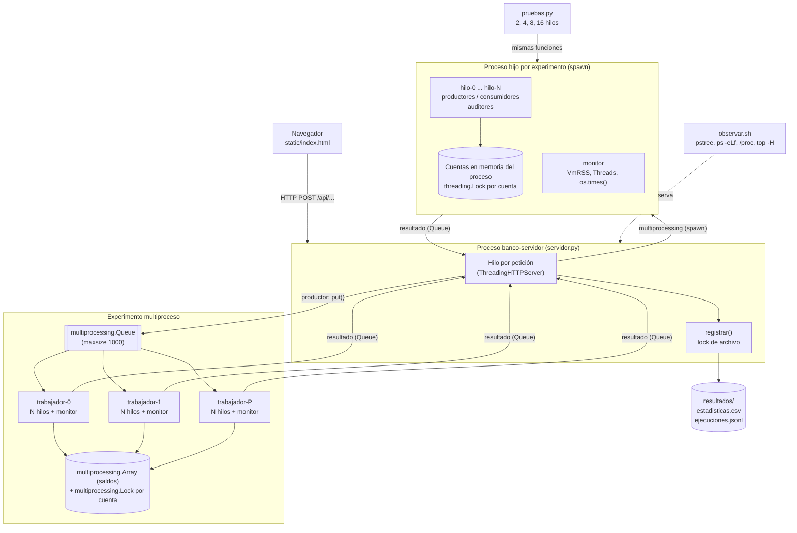
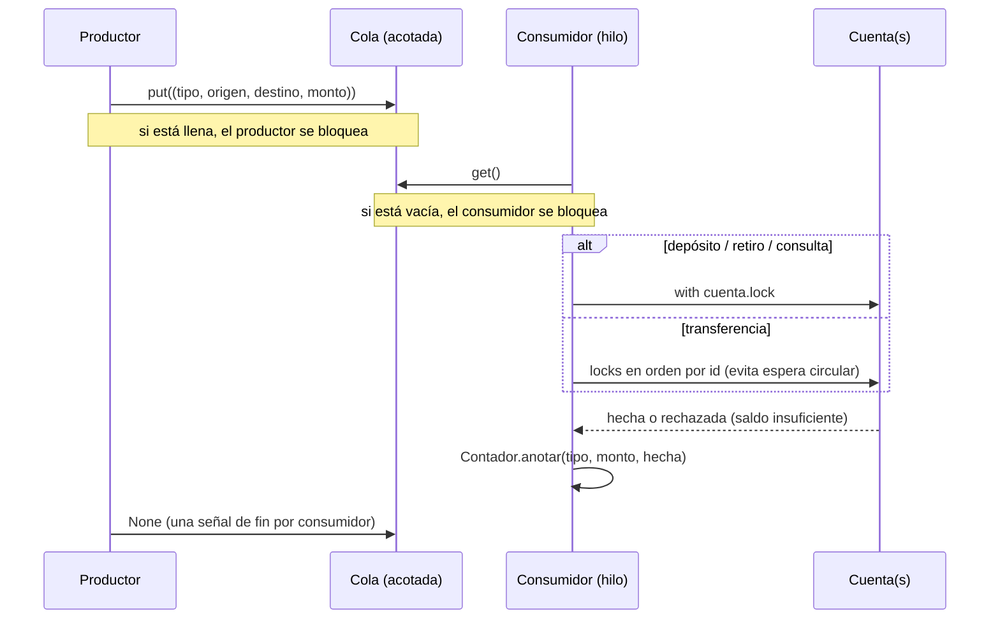

# Arquitectura

GitHub dibuja los bloques `mermaid` directamente. Para draw.io: *Organizar → Insertar → Avanzado → Mermaid* y pegar el bloque.

## Componentes y procesos

## Flujo de una transacción (cola y multiproceso)

